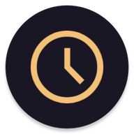

<!-- ---------- Header ---------- -->

  
  <h1>Clock You</h1>

Powerful clock app using <a href="https://m3.material.io/">Material Design 3 (You)</a> and Jetpack Compose.

<!-- ---------- Badges ---------- -->
  

    
    
    
    
    
     

<!-- ---------- Description ---------- -->
## Features

- [x] Material Design 3 (You)
- [x] Dark and light theme
- [X] Integrated clock, alarm, timer and stopwatch
- [X] Convenient user interface
- [X] Written in Jetpack Compose 

<!-- ---------- Download ---------- -->
## Download

<!-- ---------- Contribution ---------- -->
## Feedback and contributions
***All contributions are very welcome!***

* Feel free to join the [Matrix room](https://matrix.to/#/#you-apps:matrix.org) for discussions about the app.
* Bug reports and feature requests can be submitted [here](https://github.com/Bnyro/ClockYou/issues) (please make sure to fill out all the requested information properly!).
* If you are a developer and wish to contribute to the app, please **fork** the project and submit a [**pull request**](https://help.github.com/articles/about-pull-requests/).

## Translation

## License

Clock You is licensed under the [**GNU General Public License**](https://www.gnu.org/licenses/gpl.html): You can use, study and share it as you want.
